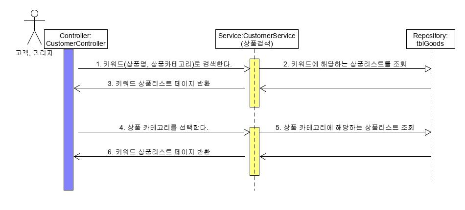
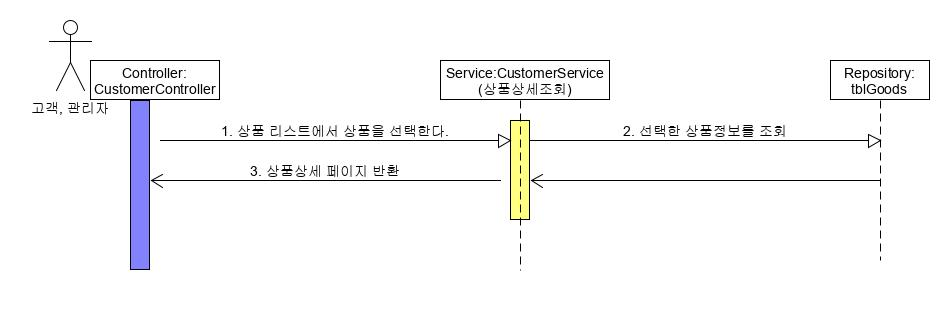
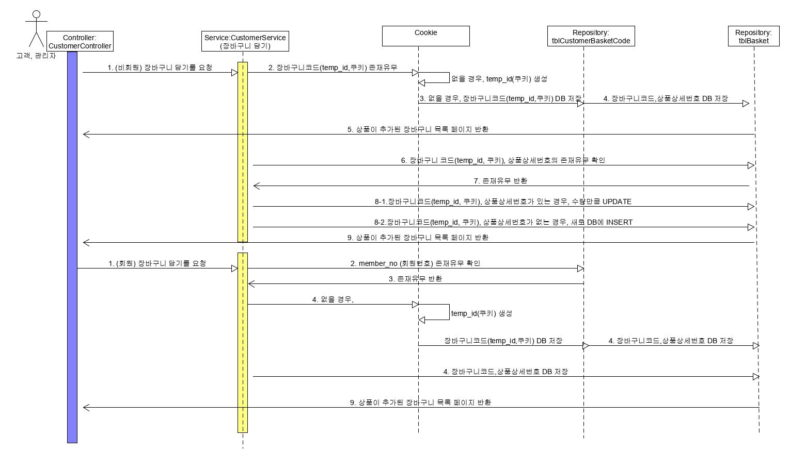
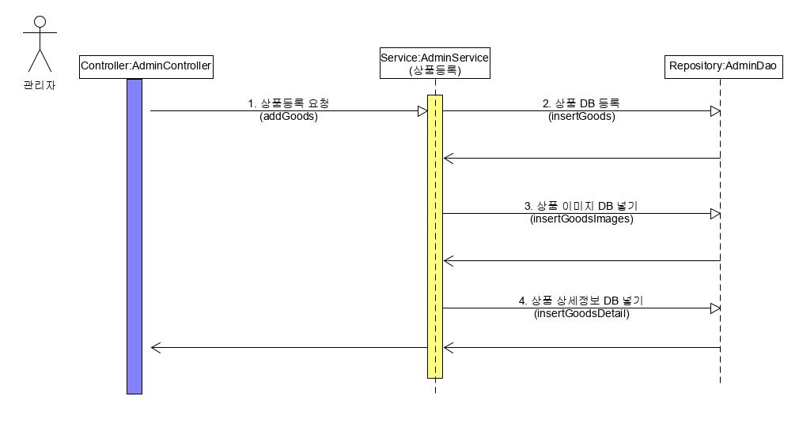
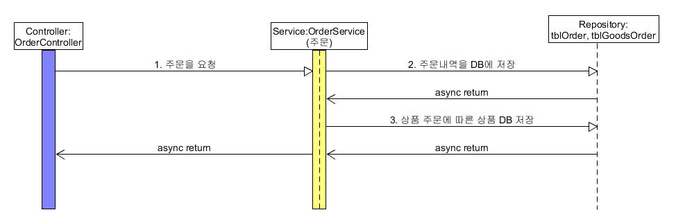
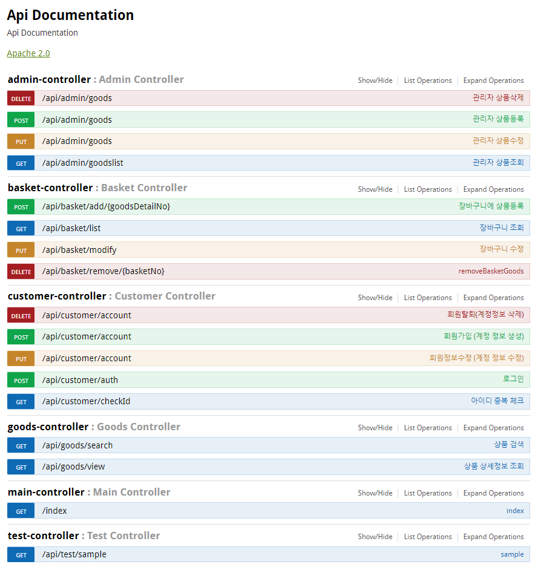

<strong>사용자 시나리오</strong>를 토대로 테스트 케이스를 작성하고자 한다. 간단한 구조를 가진 시나리오의 경우에는 바로 시나리오를 작성할 계획이고, 복잡한 시나리오는 시퀀스 다이어그램으로 도식화를 하여 테스트 케이스를 뽑아낼 예정이다.

> **메소드 명명법 (접두어)** <br>***Service 계층*** C : add, R: get, U:modify, D: remove <br>***DAO 계층*** C : insert, R: get, U:modify, D: remove <br>
>
> #### Controller <-> Service <-> DAO

1.고객 관련 (로그인, 상품리스트 조회, 상품조회)

```
CustomerController <-> CustomerService <-> CustomerDao
```

2.상품 관련

```
GoodsController <-> GoodsServce <-> GoodsDao
```

3.주문 관련

```
OrderController <-> OrderServce <-> OrderDao
```

4.장바구니 관련

```
BasketController <-> BasketService <-> BasketDao
```

5.관리자 관리

```
AdminController <-> AdminService <-> AdminDao
```

<hr>

> 로그인
> ------

### 시나리오

-	#### 로그인 성공

	1.	로그인 시도를 위해 아이디/ 비밀번호를 입력한다. <br>\{**CustomerController**::checkAuth(MemberVo),**CustomerService**::getAuthUser(MemberVo)}
	2.	DB 에서 아이디/ 비밀번호를 조건으로 존재하는지 확인한다. 존재하여 성공.<BR> {**CustomerDao**::selectAuth(MemberVo)}
-	#### 로그인 실패

	1.	로그인 시도를 위해 아이디/ 비밀번호를 입력한다. <br>\{**CustomerController**:checkAuth(MemberVo),**CustomerService**:isAuth(MemberVo)}
	2.	DB 에서 아이디/ 비밀번호를 조건으로 존재하는지 확인한다. 존재하여 실패.<BR> {**CustomerDao**::selectAuth(MemberVo)}

<hr>

> 회원가입
> --------

### 시나리오

-	#### 회원가입

	1.	약관동의 체크를 진행한다.<br> 1-1. 필수약관 미동의 경우에는 위의 1번과정을 반복한다.
	2.	약관동의 정보를 repository에 저장한다.<br> 2-1. 약관동의 정보저장이 실패했을 경우, 약관동의 페이지에 머무른다. <br>2-2. 약관동의 정보저장이 성공했을 경우, 회원정보입력 페이지로 이동한다.
-	#### 회원정보 입력 페이지에서 아이디, 이메일 중복여부 체크

	1.	아이디, 이메일 중복여부를 조회한다. (필드값 입력시, 즉시 알림, 비동기) <br> {**CustomerController**:: CheckId,**CustomerService** :: getIdCount 리턴값:1(존재)/ 0(존재하지 않음)}
	2.	아이디, 이메일 중복여부를 사용자에게 알려준다.<br> 2-1. 사용가능한 이메일이나 아이디면 회원가입 버튼이 활성화된다. -> 회원정보 등록 이동<br> 2-2. 이미 존재하는 아이디이면 회원가입 버튼이 비활성화 된다.
-	#### 회원정보 등록

	1.	회원가입 버튼을 클릭한다.
	2.	회원정보룰 저장한다. <br> {**CustomerController** :: join / **CustomerService** :: memberjoin}
	3.	회원가입완료 페이지로 이동한다.

<hr>

> 회원탈퇴
> --------

### 시나리오

-	#### 회원탈퇴 성공
	1.	회원탈퇴를 위해 필요한 사용자 비밀번호를 입력한다.<br> {**CustomerController** :: removeAccount / **CustomerService** :: removeAccount }
	2.	회원의 비밀번호와 입력한 값을 비교한다. <br> {**CustomerDao**::selectPw()}
	3.	입력한 값이 일치하여 탈퇴를 승인한다.
-	#### 회원탈퇴 실패
	1.	회원탈퇴를 위해 필요한 사용자 비밀번호를 입력한다.
	2.	회원의 비밀번호와 입력한 값을 비교한다.
	3.	입력한 값이 불일치하여 탈퇴를 반려한다.

<hr>

> 회원정보수정
> ------------

### 시나리오

-	#### 회원정보수정
	1.	회원정보수정을 위한 요청을 한다.<br> {**CustomerController** :: modifyAccount / **CustomerService** :: modifyAccount }
	2.	DB의 회원정보를 수정한다. <BR> {**CustomerController** :: updateAccount}

<hr>

> 상품검색
> --------

### 시퀀스 다이어그램



### 시나리오

-	#### 키워드(상품명, 상품카테고리)로 상품검색

	1.	키워드(키워드명, 키워드카테고리)로 검색한다.<br> { **GoodsController**::search(keyword,keywordKind)/**GoodsService**::search(keyword,keywordKind)}

	2.	키워드에 해당하는 상품리스트를 DB에서 조회 <br> { **GoodsDao**::selectProdectList(keyword,keywordKind)}

	3.	키워드에 해당하는 상품리스트 페이지 반환

	4.	#### 상품 카테고리 선택을 통한 상품검색
	5.	상품 카테고리를 선택한다.<br> { **GoodsController**::categorySearch(category_no)/ **GoodsService**::keywordSearch(category_no) }

	6.	상품 카테고리에 해당하는 상품리스트를 DB에서 조회 <br> {**GoodsDao**::selectGoodsList(category_no)}

	7.	상품 카테고리에 해당하는 상품리스트 페이지 반환

<hr>

> 상품 상세조회
> -------------

### 시퀀스 다이어그램



### 시나리오

-	#### 상품상세조회

	1.	상품리스트에서 상품을 선택한다. <br> {**GoodsController**::view(goods_detail_no)/ **GoodsService**::getGoodsInfo(goods_detail_no)}

	2.	선택한 상품정보를 DB에서 조회 <br> {**GoodsDao**::selectGoods(goods_detail_no)}

	3.	상품 상세페이지를 반환

<hr>

> 장바구니담기
> ------------

### 시퀀스 다이어그램



### 시나리오

-	#### 로그인을 하지 않았을 때, 처음 장바구니를 담는 경우
	1.	장바구니코드를 쿠키에 생성
	2.	장바구니 담기를 요청<br> {**BasketService** :: addBasket(basketCode, goodsDetailNo)}
	3.	장바구니 정보를 DB에 저장<br> {**BasketDao** :: addBasket(basketCode,goodsDetailNo)}
-	#### 로그인을 하지 않았을 때, 처음 장바구니에 담는 것이 아닌 경우
	1.	장바구니 담기를 요청<br> {**BasketService** :: addBasket(basketCode, goodsDetailNo)}
	2.	장바구니 정보를 DB에 저장<br> {**BasketDao** :: addBasket(basketCode,goodsDetailNo)}
-	#### 로그인했을 때, 처음 장바구니를 담는 경우
	1.	장바구니코드를 쿠키에 생성하고 회원번호와 함께 DB에 저장
	2.	장바구니 담기를 요청<br> {**BasketService** :: addBasket(basketCode, goodsDetailNo)}
	3.	장바구니 정보를 DB에 저장<br> {**BasketDao** :: addBasket(basketCode,goodsDetailNo)}
-	#### 로그인했을 때, 처음 장바구니에 담는 것이 아닌 경우
	1.	회원에 해당하는 장바구니번호를 찾는다.
	2.	장바구니 담기를 요청<br> {**BasketService** :: addBasket(basketCode, goodsDetailNo)}
	3.	장바구니 정보를 DB에 저장<br> {**BasketDao** :: addBasket(basketCode,goodsDetailNo)}

<hr>

> 장바구니삭제
> ------------

### 시나리오

-	#### 장바구니삭제

	1.	삭제할 장바구니의 상품을 선택 <BR> {**BasketController** :: removeBasketGoods(basketNo)/**BasketService** :: removeBasketGoods(basketNo)}
	2.	해당 장바구니의 상품을 DB에서 삭제 <BR> {**BasketDao** :: deleteBasketGoods(basketNo)}

<hr>

> 상품주문
> --------

### 시나리오

-	#### 사용자가 상품을 주문한다.
-	#### 사용자가 상품 주문내역을 조회한다.
-	#### 사용자가 상품 주문내역을 삭제한다.

<hr>

> 상품등록 (관리자)
> -----------------

### 시퀀스 다이어그램



### 시나리오

-	#### 관리자가 상품을 등록한다.

<hr>

> 상품목록 (관리자)
> -----------------

### 시나리오

-	#### 관리자가 상품목록을 보여준다.
	1.	관리자가 상품목록을 요청한다. <br> {**AdminController** :: goodsList() / **AdminService** :: goodsList() }
	2.	DB에서 상품목록을 조회한다. <BR> {**AdminDao** :: selectGoodsList()}

<hr>

> 상품수정 (관리자)
> -----------------

### 시나리오

-	#### 관리자가 상품을 수정한다.
	1.	관리자가 상품을 수정한다. <br> {**AdminController** :: modifyGoodsInfo(GoodsVo) (*put*) / **AdminService** :: modifyGoodsInfo(GoodsVo)}
	2.	수정된 정보를 DB에 저장한다. <BR> {**AdminDao** :: updateGoodsInfo(GoodsVo)}

> 상품삭제 (관리자)
> -----------------

### 시나리오

-	#### 관리자가 상품을 삭제한다.

	1.	관리자가 상품을 삭제한다. <br> {**AdminController** :: removeGoodsInfo(goodsNo) (*delete*) / **AdminService** :: removeGoodsInfo(GoodsVo)}
	2.	수정된 정보를 DB에 저장한다. <BR> {**AdminDao** :: deleteGoodsInfo(goodsNo)}

<hr>

> 카테고리관리 (관리자)
> ---------------------

### 시나리오

-	#### 관리자가 1차카테고리/2차카테고리를 등록한다.
-	#### 관리자가 카테고리목록을 조회한다.
-	#### 관리자가 1차카테고리/2차카테고리를 수정한다.
-	#### 관리자가 1차카테고리/ 2차카테고리를 삭제한다.

<hr>

> 주문관리 (관리자)
> -----------------

### 시퀀스 다이어그램



### 시나리오

-	#### 관리자가 주문내역을 조회한다.
-	#### 관리자가 주문취소내역을 조회한다.

<hr>

> 회원관리 (관리자)
> -----------------

### 시나리오

-	#### 관리자가 회원정보를 조회한다.
-	#### 관리자가 회원정보를 삭제한다.

<hr>

**API List(Swagger) ver1.0**
============================


